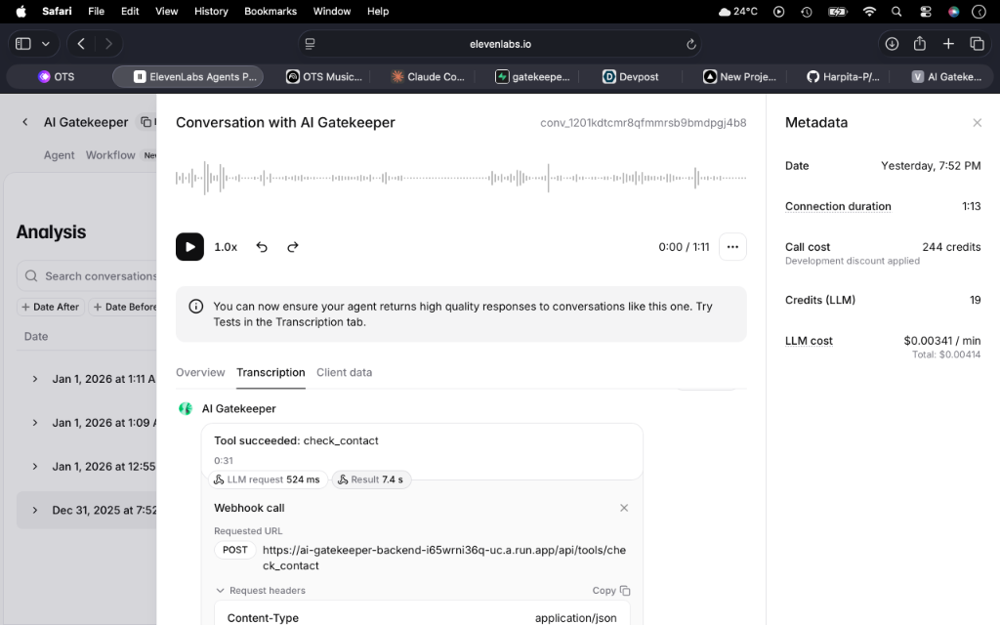
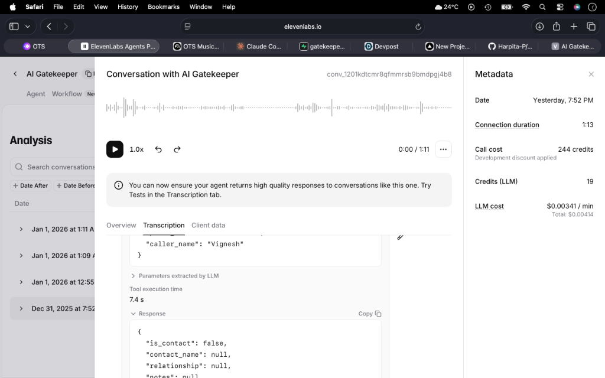
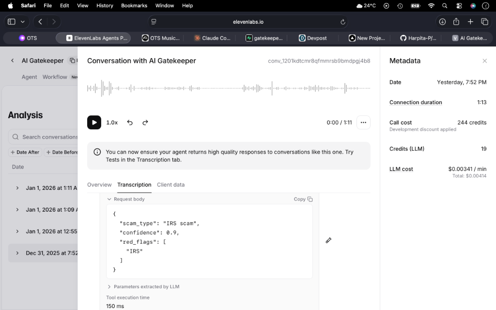

# AI Gatekeeper - Visual Assets

This directory contains all visual assets for the AI Gatekeeper project, including product screenshots and architecture diagrams.

## 📱 Product Screenshots

Located in `screenshots/`:

### Main Dashboard Views

*Main dashboard with glowing orb showing threats blocked and protection status*


*Dashboard with detailed statistics and call history*


*Analytics view tracking protection metrics over time*


*Detailed statistics showing total calls, time saved, block rate, and today's activity*

### Call Management

*Complete call history with filtering options*


*Detailed call list showing blocked and passed calls with timestamps*

### Voice & Settings

*Voice control interface for hands-free interaction*


*Full voice interface with "Tap to Start" prompt*


*Settings overview with profile, voice, notifications, and privacy options*


*Complete settings page with all configuration options*

---

## 🏗️ Architecture Diagrams

Located in `architecture/`:

### System Overview

*Complete system architecture showing integration between Twilio, ElevenLabs, and Google Cloud services*

### Call Flow

*Detailed call routing logic for Accessibility and Gatekeeper modes with parallel agent execution*

### Agent Architecture

*Multi-agent system with specialized agents for screening, detection, and decision-making*

### Sequence Diagram

*Real-time interaction flow showing sub-100ms response times and parallel processing*

### Database Schema

*Supabase database schema with optimized tables for users, calls, contacts, and vector embeddings*

---

## 📝 Usage

### For GitHub README
```markdown

```

### For Devpost Submission
Upload images from:
- `assets/screenshots/` - Product interface screenshots
- `assets/architecture/` - Technical architecture diagrams

### For Documentation
All images are also available in the web app at:
- Product screenshots: `/images/features/`
- Architecture diagrams: `/images/architecture/`

---

## 🎨 Image Details

### Screenshots
- **Format**: PNG
- **Purpose**: Showcase the user interface and user experience
- **Total**: 10 images
- **Size**: ~160-240 KB each

### Architecture Diagrams
- **Format**: PNG
- **Purpose**: Technical documentation and system design
- **Total**: 5 diagrams
- **Size**: ~60-110 KB each

---

## 🎯 Proof of Working

Located in `proofs/`:

### ElevenLabs Integration Evidence

*Server tool `check_contact` successfully executing - 524ms LLM, 74ms result*


*Structured JSON response from backend showing contact lookup results*


*Live conversation with performance metrics - 418ms LLM, 192ms TTS, 119ms ASR*


*Server tool `block_scam` successfully executing - 471ms LLM, 150ms result*


*Scam detection details - IRS scam identified with 90% confidence*

---

Built for **AI Partner Catalyst 2025** 🚀
